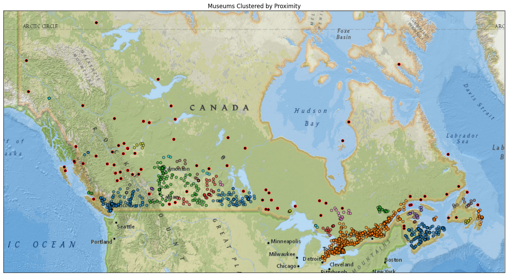
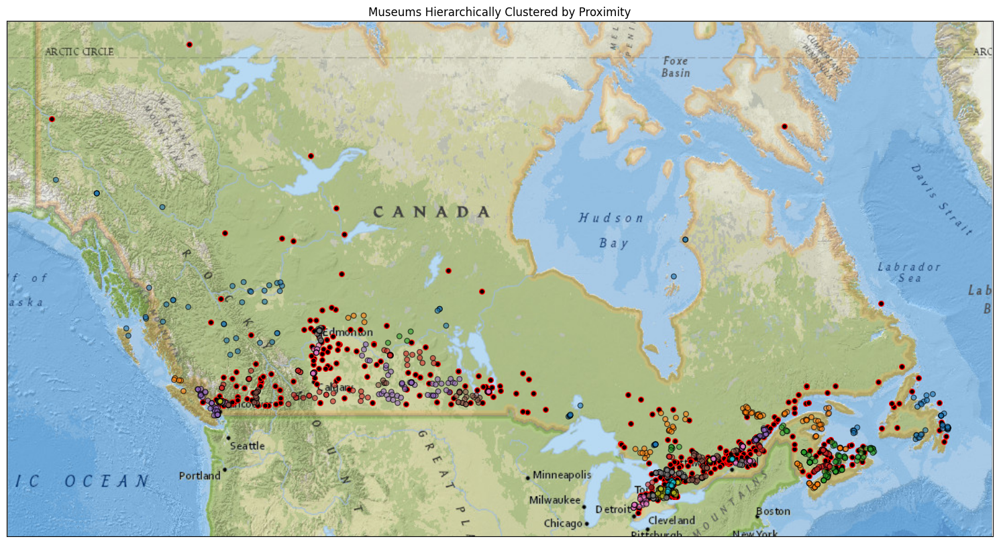

# DBSCAN and HDBSCAN for Geographic Clustering of Museums in Canada

This project applies two density-based unsupervised learning algorithms, DBSCAN and HDBSCAN, to museum location data from Canada. The goal is to identify groups of museums that are geographically close to one another and to distinguish isolated locations as noise or outliers.

The notebook uses latitude and longitude coordinates, performs clustering on scaled geographic features, and visualizes the results on top of a Canada basemap.

## Project Goal

The main purpose of this project is to explore how density-based clustering can be used on geographic coordinate data.

More specifically, the notebook:

- loads a dataset of cultural facilities
- filters the data to keep only museums
- keeps only latitude and longitude as the clustering features
- applies DBSCAN
- applies HDBSCAN
- assigns cluster labels to each museum
- overlays the clustered points on a Canada map for visual interpretation

This makes it possible to compare two related clustering methods on a real spatial dataset.

## Dataset

The data comes from a StatCan-curated source of cultural facilities in Canada.

After loading the dataset, the notebook filters the rows so that only facilities of type `museum` remain. Then it keeps only the two geographic columns:

- `Latitude`
- `Longitude`

Rows with missing coordinate values are removed before clustering.

## Why Clustering is Useful Here

Clustering is useful when labels are not known in advance. In this project, there is no predefined category telling us which museums belong to which geographic group. Instead, the models detect structure directly from the spatial distribution of the points.

For geographic data, clustering can help answer questions such as:

- Which museums are located in dense regional groups?
- Which museums are relatively isolated?
- Are there natural location-based groupings without manually defining regions?

## Models Used

## DBSCAN

DBSCAN stands for Density-Based Spatial Clustering of Applications with Noise.

It is an unsupervised machine learning algorithm that groups points into clusters based on local density. A cluster is formed when enough points lie close to one another. Points that do not belong to any sufficiently dense region are labeled as noise.

DBSCAN is useful because:

- it does not require specifying the number of clusters in advance
- it can identify noise points
- it can find irregularly shaped clusters
- it works well when clusters are defined by density rather than by spherical separation

### Main DBSCAN Parameters

- `eps`: the neighborhood radius
- `min_samples`: the minimum number of nearby points needed to form a dense region
- `metric`: the distance function used to measure closeness

In the notebook, the parameters are:

- `eps = 1.0`
- `min_samples = 3`
- `metric = 'euclidean'`

### Plain Math Intuition for DBSCAN

For a point `x_i`, DBSCAN looks at its neighborhood:

`N_eps(x_i) = { x_j : d(x_i, x_j) <= eps }`

where:

- `d(x_i, x_j)` is the distance between points `x_i` and `x_j`
- `eps` is the search radius

A point is considered a core point if:

`|N_eps(x_i)| >= min_samples`

This means the point has enough nearby neighbors to be considered part of a dense region.

A cluster is then built by connecting dense regions and nearby reachable points. Points that are not density-reachable from any cluster are assigned the label `-1`, meaning noise.

## HDBSCAN

HDBSCAN stands for Hierarchical Density-Based Spatial Clustering of Applications with Noise.

It extends DBSCAN by building a hierarchy of density-based clusters rather than relying on one fixed density threshold in exactly the same way. This makes it better suited for data in which different clusters may have different densities.

HDBSCAN is useful because:

- it can detect clusters with varying densities
- it can still identify noise points
- it does not require the number of clusters in advance
- it is often more flexible than DBSCAN on real-world data

### Main HDBSCAN Parameters

In the notebook, the main parameters are:

- `min_cluster_size = 3`
- `min_samples = None`
- `metric = 'euclidean'`

### Plain Math Intuition for HDBSCAN

HDBSCAN can be understood as building clusters from density connectivity over multiple density levels.

A useful quantity is the core distance. For a point `x_i`, the core distance is the distance to its `k`-th nearest neighbor, where `k` is related to the chosen neighborhood size.

Then a mutual reachability distance between points `x_i` and `x_j` is defined as:

`d_mr(x_i, x_j) = max(core_k(x_i), core_k(x_j), d(x_i, x_j))`

This adjusted distance makes sparse points appear farther apart and dense regions more stable. HDBSCAN builds a hierarchy using these distances and then extracts the most stable clusters from that hierarchy.

The key idea is that cluster structure is evaluated across multiple density scales rather than using only one fixed neighborhood rule.

## Geographic Feature Scaling

The notebook performs clustering on scaled coordinates rather than directly on the raw latitude values.

The code does:

`coords_scaled["Latitude"] = 2 * coords_scaled["Latitude"]`

This means the latitude coordinate is multiplied by 2 before clustering.

### Why Scaling Was Applied

The notebook notes that latitude and longitude should not be standardized using sample-based normalization such as z-score normalization, because these coordinates already have real geographic meaning.

The idea in the notebook is that latitude and longitude do not span the same angular range globally, so one coordinate is manually reweighted rather than standardized from the observed sample.

This is important because DBSCAN and HDBSCAN are distance-based methods, and distance calculations are sensitive to feature scale.

### Plain Math for Euclidean Distance Here

If a point has coordinates `(lat_i, lon_i)` and another point has `(lat_j, lon_j)`, then Euclidean distance in the scaled space becomes:

`d(i, j) = sqrt((2 * lat_i - 2 * lat_j)^2 + (lon_i - lon_j)^2)`

which simplifies to:

`d(i, j) = sqrt(4(lat_i - lat_j)^2 + (lon_i - lon_j)^2)`

So latitude differences are given greater weight than they would have had in the unscaled coordinate space.

## Technical Workflow in the Notebook

## 1. Install dependencies

The notebook installs the required packages, including:

- `numpy`
- `pandas`
- `scikit-learn`
- `matplotlib`
- `hdbscan`
- `geopandas`
- `contextily`
- `shapely`

These libraries support data manipulation, clustering, plotting, and geographic visualization.

## 2. Load the Canada basemap

A ZIP file containing a Canada TIFF basemap is downloaded and extracted. This file is later used for map visualization.

The plotting function expects the file:

`./Canada.tif`

to exist in the working directory.

## 3. Load the cultural facilities dataset

The notebook reads the CSV dataset into a pandas DataFrame.

## 4. Filter to museums

Only rows where the facility type is `museum` are kept.

## 5. Keep only coordinates

The DataFrame is reduced to:

- `Latitude`
- `Longitude`

Rows with missing coordinate values are removed, and the remaining values are converted to floating-point numbers.

## 6. Create scaled coordinates

A copy of the coordinate table is made for clustering:

`coords_scaled = df.copy()`

Then latitude is rescaled:

`coords_scaled["Latitude"] = 2 * coords_scaled["Latitude"]`

## 7. Fit DBSCAN

The notebook trains DBSCAN on `coords_scaled`:

`dbscan = DBSCAN(...).fit(coords_scaled)`

After fitting, the model contains cluster labels in:

`dbscan.labels_`

These labels are then assigned back to the original unscaled DataFrame:

`df["Cluster"] = dbscan.fit_predict(coords_scaled)`

A cleaner equivalent would be:

`df["Cluster"] = dbscan.labels_`

since the model was already fitted one line earlier.

## 8. Visualize DBSCAN results

The custom plotting function converts the DataFrame into a GeoDataFrame, reprojects it into Web Mercator, plots clustered points and noise points separately, and overlays the result on the Canada TIFF basemap.

## 9. Fit HDBSCAN

The notebook then builds and applies HDBSCAN using the same scaled coordinates:

`df["Cluster"] = hdb.fit_predict(coords_scaled)`

This overwrites the previous DBSCAN labels in the `Cluster` column with HDBSCAN labels.

## 10. Visualize HDBSCAN results

The clustered museum locations are plotted again using the same geographic plotting function.

## Output Interpretation

For both models, each row receives a cluster label.

Typical meaning of labels:

- `0`, `1`, `2`, ... represent detected clusters
- `-1` represents noise or outliers

The cluster labels are not rankings. For example, cluster `0` is not better or larger than cluster `1`; it is simply an identifier.

## Figures and Analysis

## DBSCAN Figure

The DBSCAN visualization shows museum locations grouped by local density. Museums that lie close enough to one another under the chosen `eps` radius and satisfy the `min_samples` requirement are assigned to the same cluster. Points that do not belong to any dense region are shown as noise.

From this figure, the main observations are:

- DBSCAN produces discrete geographic groups based on local proximity
- isolated museums are naturally treated as noise
- the clustering depends strongly on the chosen neighborhood radius and minimum density threshold
- DBSCAN is effective when one density setting is appropriate across the dataset

Because DBSCAN uses a fixed neighborhood scale, some areas may be split or labeled as noise if the local density differs too much from the global parameter choice.

## HDBSCAN Figure

The HDBSCAN visualization shows a related but more flexible density-based grouping. Since HDBSCAN evaluates cluster structure hierarchically, it can better adapt when different regions have different local densities.

From this figure, the main observations are:

- HDBSCAN can be more flexible than DBSCAN when density varies by region
- it may preserve meaningful clusters that DBSCAN would partially fragment
- it still identifies sparse or isolated points as noise
- it is often a better choice when one fixed density threshold is too restrictive

## Comparison of DBSCAN and HDBSCAN

Both models are density-based and both are appropriate for spatial clustering. However, they differ in flexibility.

DBSCAN:

- simpler and easier to interpret
- depends strongly on `eps`
- works well when cluster density is relatively consistent

HDBSCAN:

- more adaptive to density variation
- can recover clusters across multiple density levels
- often performs better on heterogeneous spatial distributions

In this project, both approaches are useful because they allow comparison between a fixed-density method and a hierarchical density-based method on the same museum coordinate dataset.

## Notes About the Plotting Function

The plotting function does not perform clustering. It only visualizes results that were already computed.

It:

- converts the DataFrame into a GeoDataFrame
- creates point geometry from longitude and latitude
- reprojects coordinates to `EPSG:3857`
- separates cluster points from noise points
- plots them on top of `Canada.tif`

So the function is a visualization step, not a learning step.

## Files Needed

To run the notebook successfully, make sure the following are available:

- `DBSCAN-and-HDBSCAN.ipynb`
- `Canada.tif`
- `dbscan.png` if you want the DBSCAN figure shown in the README
- `hdbscan.png` if you want the HDBSCAN figure shown in the README

If `Canada.tif` is not already present, the notebook includes code that downloads and extracts it. But if you are sharing the repository and want the notebook to run smoothly without repeating that step, keeping `Canada.tif` in the project directory is helpful.

## How to Run

1. Install the required Python packages.
2. Open the notebook.
3. Run the cells in order.
4. Make sure `Canada.tif` is available in the working directory before the plotting step.
5. Review the DBSCAN and HDBSCAN visual results.

## Possible Improvements

Some possible extensions of this project would be:

- use a geographic distance such as haversine distance instead of plain Euclidean distance
- compare results under multiple parameter settings
- preserve separate output columns for DBSCAN and HDBSCAN instead of overwriting `Cluster`
- add quantitative cluster summaries such as number of clusters, noise proportion, and cluster size distribution
- compare spatial clustering with alternative methods such as K-means for contrast

## Summary

This project demonstrates how density-based clustering can be used to analyze real geographic coordinate data. By applying DBSCAN and HDBSCAN to museum locations in Canada, the notebook identifies dense regional groupings and isolates sparse points as noise. The final map-based visualizations make the clustering behavior easy to interpret and provide a practical comparison between two important unsupervised learning techniques.
