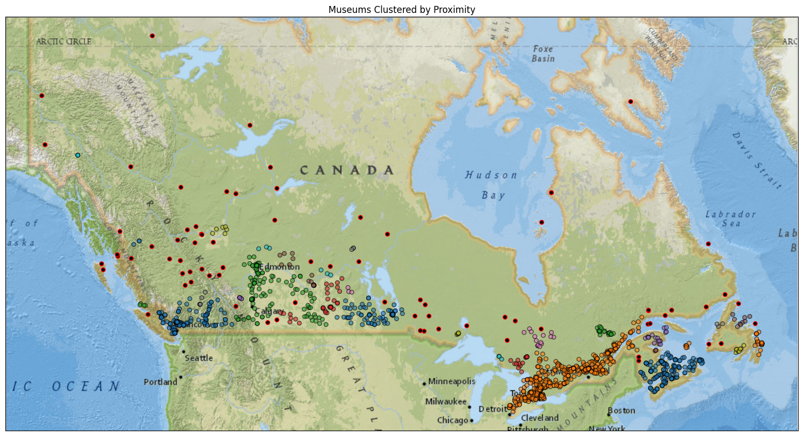
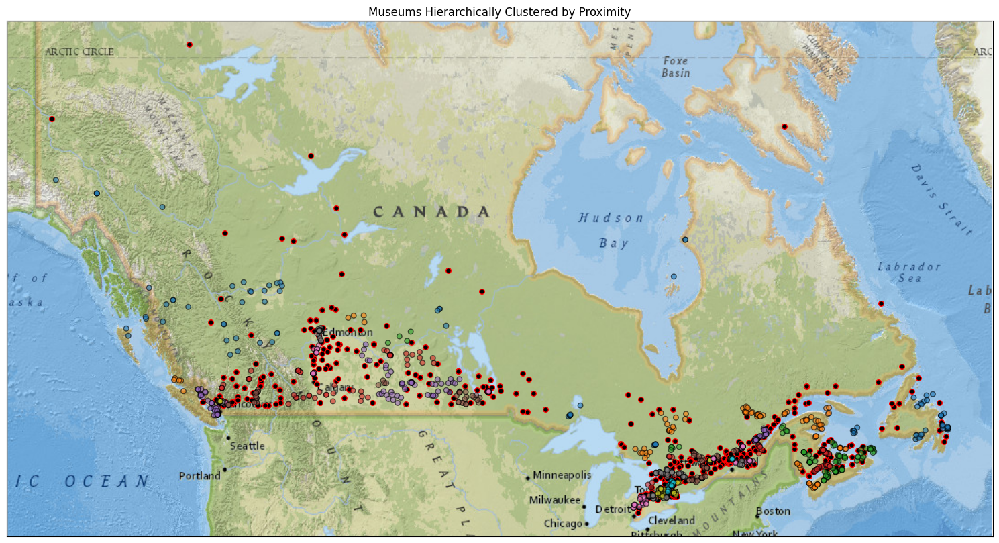

# DBSCAN and HDBSCAN for Geographic Clustering of Museums in Canada

This project applies two density-based clustering algorithms, DBSCAN and HDBSCAN, to museum locations in Canada. The goal is to find groups of museums that are geographically close and to mark isolated ones as noise.

The clustering uses latitude and longitude, and the results are plotted on a Canada basemap.

## Dataset

The data is a StatCan-curated dataset of cultural facilities in Canada. The notebook keeps only rows of type `museum` and only the `Latitude` and `Longitude` columns, and drops rows with missing coordinates.

## Workflow

1. Install `numpy`, `pandas`, `scikit-learn`, `matplotlib`, `hdbscan`, `geopandas`, `contextily`, `shapely`.
2. Download and extract the Canada basemap (`Canada.tif`).
3. Load the dataset, filter to museums, and keep the coordinates.
4. Scale latitude by 2 (see below).
5. Fit DBSCAN and plot the clusters.
6. Fit HDBSCAN and plot the clusters.

## Scaling the Coordinates

Latitude and longitude are not z-score normalized, since they already have real geographic meaning. Instead latitude is multiplied by 2, because latitude and longitude don't span the same angular range:

`coords_scaled["Latitude"] = 2 * coords_scaled["Latitude"]`

So the Euclidean distance becomes:

`d(i, j) = sqrt(4(lat_i - lat_j)^2 + (lon_i - lon_j)^2)`

## DBSCAN

DBSCAN groups points by local density. It doesn't need the number of clusters in advance, it can find irregular shapes, and it labels points outside dense regions as noise (`-1`).

For a point `x_i`, its neighborhood is:

`N_eps(x_i) = { x_j : d(x_i, x_j) <= eps }`

A point is a core point if `|N_eps(x_i)| >= min_samples`. Clusters grow by connecting core points and the points reachable from them.

Parameters: `eps = 1.0`, `min_samples = 3`, `metric = 'euclidean'`.

DBSCAN forms groups based on local proximity and treats isolated museums as noise. Since it uses one fixed radius, regions with a different density can get split up or marked as noise.

## HDBSCAN

HDBSCAN builds a hierarchy of density-based clusters instead of using one fixed threshold, so it handles clusters with different densities better.

It uses the core distance (distance to the k-th nearest neighbor) to define the mutual reachability distance:

`d_mr(x_i, x_j) = max(core_k(x_i), core_k(x_j), d(x_i, x_j))`

This pushes sparse points farther apart. HDBSCAN builds a hierarchy with these distances and keeps the most stable clusters.

Parameters: `min_cluster_size = 3`, `min_samples = None`, `metric = 'euclidean'`.

HDBSCAN adapts better to regions with different densities and keeps some clusters that DBSCAN breaks apart, while still marking isolated points as noise.

## Labels

- `0`, `1`, `2`, ...: cluster IDs (not rankings)
- `-1`: noise

## Plotting

The plotting function only visualizes the results. It converts the DataFrame to a GeoDataFrame, reprojects to `EPSG:3857`, plots cluster points and noise separately, and overlays them on `Canada.tif`.

## Possible Improvements

- Use haversine distance instead of Euclidean
- Try several parameter settings
- Store DBSCAN and HDBSCAN labels in separate columns (right now HDBSCAN overwrites `Cluster`)
- Report the number of clusters, noise fraction, and cluster sizes
- Compare with K-means
